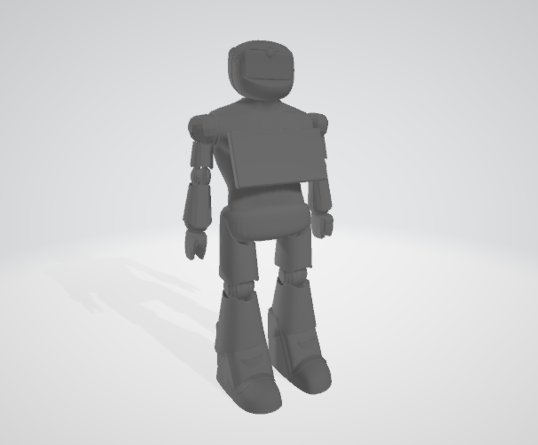
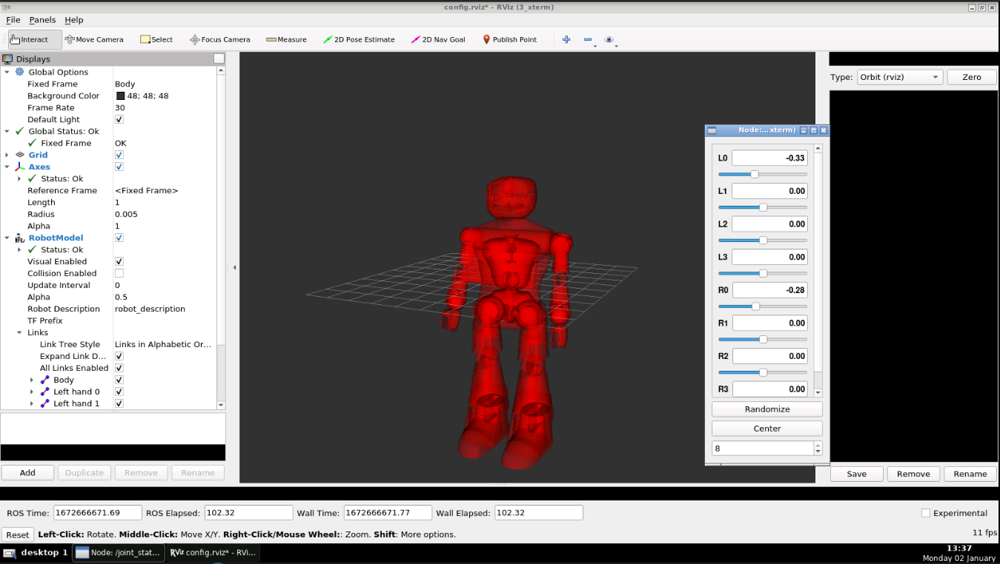
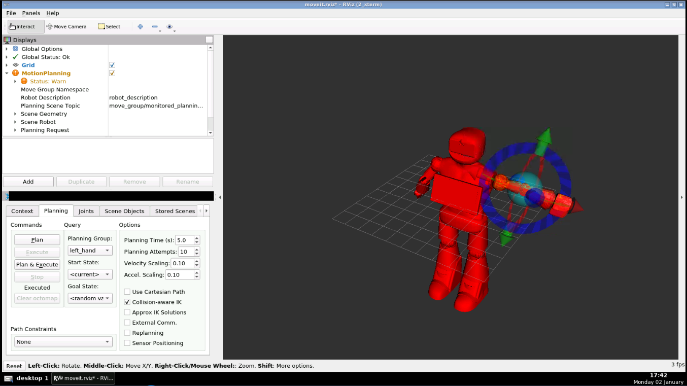
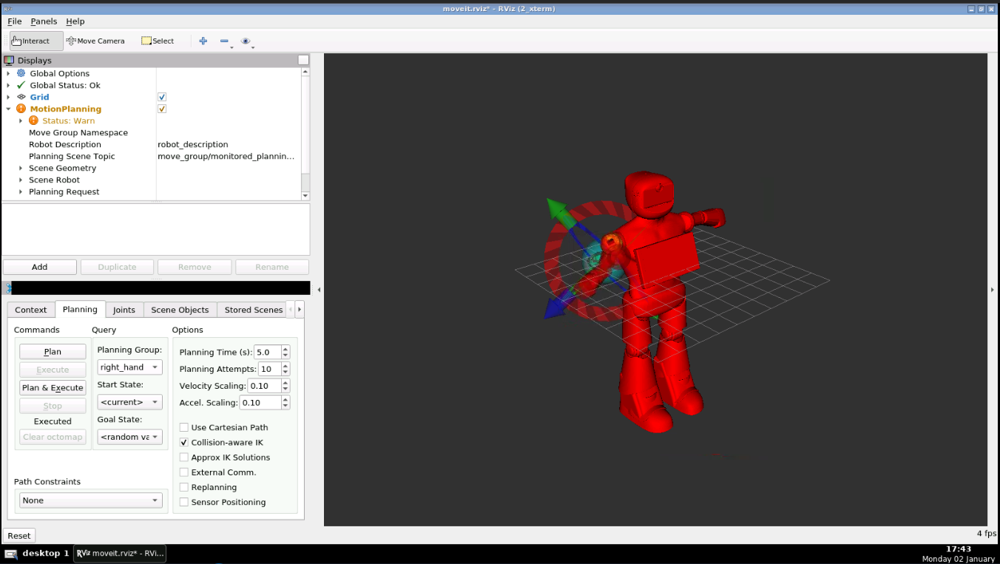

# robot1_ROS
ROS packages to control a humanoid robot



## Dependencies
run this instruction inside your workspace:

for noetic distro

```
$ sudo apt-get install ros-noetic-moveit
$ sudo apt-get install ros-noetic-joint-state-publisher ros-noetic-joint-state-publisher-gui
$ sudo apt-get install ros-noetic-gazebo-ros-control joint-state-publisher
$ sudo apt-get install ros-noetic-ros-controllers ros-noetic-ros-control
```

## Usage
### Controlling the robot by joint_state_publisher
```$ roslaunch robot1_pkg joint_states.launch```




### Controlling the robot arm by Moveit and kinematics
Choose either "left_hand" or "right_hand" from "Planning Group"

```$ roslaunch robot1_moveit_pkg demo.launch```





